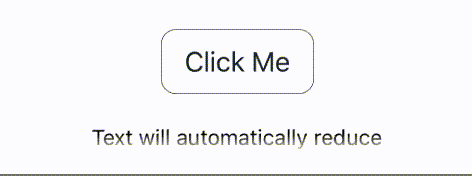

</p>

<h2 align="center">@huds0n/components</h3>

</p>

<div align="center">

[]()
[](https://github.com/JontiHudson/modules-huds0n-components/issues)
[](https://github.com/JontiHudson/modules-huds0n-components/pulls)
[](/LICENSE)

</div>

---

<p align="center"><p align="center">Enhanced components for <b>React Native</b>.</br><b>Badge</b>, <b>Button</b>, <b>FadeOverlay</b>, <b>FlatList</b>, <b>Icon</b>, <b>Pressable</b>, <b>ScrollView</b>, and <b>View</b>.
</p>

</br>

## 📝 Table of Contents

- [About](#about)
- [Components](#components)
- [Getting Started](#getting_started)
- [Usage](#usage)
  - [Badge](#badge)
  - [Button](#button)
  - [FadeOverlay](#fade_overlay)
  - [FadeOverlayContainer](#fade_overlay_container)
  - [FlatList](#flat_list)
  - [Icon](#icon)
  - [Pressable](#pressable)
  - [ScrollView](#scroll_view)
  - [View](#view)
- [Authors](#authors)
- [Acknowledgments](#acknowledgement)

</br>

## 🧐 About <a name = "about"></a>

Enhanced common react native components!

</br>

## ✅ List of Components <a name = "components"></a>

- **Badge:** _Numbered badge, similar to IOS notification badge._
- **Button:** _Highly customizable button, with built-in spinner._
- **FadeOverlay:** _Overlay container that enables fading at component edges._
- **FlatList:** _Enhanced to have built-in pull to refresh, scroll fading, and more._
- **Icon:** _Use either image or vector icon props, and optional badge._
- **Pressable:** _Easily control feedback._
- **ScrollView:** _Automatic scroll to focus when used with [@huds0n/inputs](https://github.com/JontiHudson/modules-huds0n-inputs), dynamically disables scrolling when content less than view._
- **View:** Has onPressThrough method and enables passing layout directly to children.\_

</br>

## 🏁 Getting Started <a name = "getting_started"></a>

### **Prerequisites**

Requires **React Native** 0.63 or above. If using **Expo** install **@expo/vector-icons** and **expo-linear-gradient**, otherwise install and link **react-native-vector-icons** and **react-native-linear-gradient**.

</br>

### **Installing**

```
npm i @huds0n/components
```

</br>

## 🧑‍💻 Usage <a name="usage"></a>

### **Badge**<a name="badge"></a>

| Prop           | Required/(_Default_) | Description                                                                                                    | Type                             |
| -------------- | :------------------: | -------------------------------------------------------------------------------------------------------------- | -------------------------------- |
| color          |      _#E63B2E_       | Background color                                                                                               | _string_                         |
| containerStyle |          -           | Badge container style                                                                                          | _viewstyle_                      |
| maxValue       |         _9_          | Over this value the badge will just show a plus</br>Prevents large badge values which will be difficult to see | _number_                         |
| offset         |          -           | Translates badge to the right offset                                                                           | _{ x?: number,</br>y?: number }_ |
| size           |          14          | Size of badge                                                                                                  | _number_                         |
| textColor      |      _#FFFFFF_       | Text color                                                                                                     | _string_                         |
| textStyle      |      _#FFFFFF_       | Button text style color                                                                                        | _textStyle_                      |
| value          |          ✔           | Current badge value                                                                                            | _number_                         |

</br>

### **Button**<a name="button"></a>

_Inherits all [Pressable props](#pressable)._

| Prop                | Required/(_Default_) | Description                                                                                                                                                          | Type        |
| ------------------- | :------------------: | -------------------------------------------------------------------------------------------------------------------------------------------------------------------- | ----------- |
| color               |          -           | Background color                                                                                                                                                     | _string_    |
| disabledLabelStyle  |          -           | Label style when disabled                                                                                                                                            | _textStyle_ |
| disabledStyle       |          -           | Disabled container style                                                                                                                                             | _viewstyle_ |
| dismissInputOnPress |         true         | If true, input is dismissed on button press                                                                                                                          | _boolean_   |
| label               |          -           | Label text</br>Also set by passing a string as a child prop                                                                                                          | _string_    |
| labelStyle          |          -           | Label style                                                                                                                                                          | _textStyle_ |
| pressedStyle        |          -           | Pressed container style                                                                                                                                              | _viewstyle_ |
| pressedLabelStyle   |          -           | Pressed label style                                                                                                                                                  | _textStyle_ |
| spinner             |        false         | Show activitity indicatior instead of label                                                                                                                          | _boolean_   |
| spinnerColor        |      _#FFFFFF_       | Color of activity indicator                                                                                                                                          | _string_    |
| spinnerStyle        |          -           | Spinner container style                                                                                                                                              | _viewStyle_ |
| style               |          -           | Base container style                                                                                                                                                 | _viewstyle_ |
| useIsConnected      |          -           | If true, becomes disabled when there is no network</br>Requires [@huds0n/network-manager](https://github.com/JontiHudson/modules-huds0n-network-manager) initialized | _boolean_   |

</br>

### **FadeOverlay**<a name="fade_overlay"></a>

</br>

<div style="text-align:center">



</div>

| Prop      | Required/(_Default_) | Description                     | Type                                        |
| --------- | :------------------: | ------------------------------- | ------------------------------------------- |
| color     |      _#FFFFFF_       | Oapaque color color             | _string_                                    |
| height    |          -           | Height of container             | _number_ or _string_                        |
| intensity |          2           | The rate fade                   | _integer_                                   |
| position  |        _TOP_         | Defines which direction to fade | _'TOP'_, _'BOTTOM'_, _'LEFT'_, or _'RIGHT'_ |
| width     |          -           | Width of container              | _number_ or _string_                        |

</br>

### **FadeOverlayContainer**<a name="fade_overlay_container"></a>

| Prop   | Required/(_Default_) | Description | Type                                              |
| ------ | :------------------: | ----------- | ------------------------------------------------- |
| top    |          -           | Top fade    | _[FadeOverlay Props](#fade_overlay)_ or _boolean_ |
| bottom |          -           | Bottom fade | _[FadeOverlay Props](#fade_overlay)_ or _boolean_ |
| left   |          -           | Left fade   | _[FadeOverlay Props](#fade_overlay)_ or _boolean_ |
| right  |          -           | Right fade  | _[FadeOverlay Props](#fade_overlay)_ or _boolean_ |

</br>

_This component can be placed within any view, quickly adding fading to any/all sides. If option is true a standard white fade is used_

</br>

### **FlatList**<a name="flat_list"></a>

_Like the **ScrollView**, the **FlatList** will automatically disable its scroll if the conents are smaller than the container._

| Prop                   | Required/(_Default_) | Description                                                              | Type                                                    |
| ---------------------- | :------------------: | ------------------------------------------------------------------------ | ------------------------------------------------------- |
| activityIndicatorColor |          -           | Activity indicator color on pull to refresh                              | _string_                                                |
| fade                   |          -           | Controls edge fading                                                     | _[FadeOverlayContainer Props](#fade_overlay_container)_ |
| keyName                |          -           | Extract key from an element's property</br>Data elements must be objects | key of data element                                     |
| onPullToRefresh        |          -           | Adds **Refresh Control**, runs on pulling down                           | _() => (void \| Promise\<void>)_                        |

</br>

### **Icon**<a name="icon"></a>

_Inherits all [Pressable props](#pressable) except style._

| Prop                | Required/(_Default_) | Description                                   | Type                                                                |
| ------------------- | :------------------: | --------------------------------------------- | ------------------------------------------------------------------- |
| badge               |         _0_          | Adds badge with value                         | _number_                                                            |
| dismissInputOnPress |        _true_        | If true, input is dismissed on icon press     | _boolean_                                                           |
|                     |                      |                                               |
| backgroundColor     |          -           | Background color                              | _string_                                                            |
| badgeProps          |          -           | Style badge                                   | [Badge props](#badge)                                               |
| color               |          -           | Icon color                                    | _string_                                                            |
| containerStyle      |          -           | Badge container style                         | _viewstyle_                                                         |
| size                |         _20_         | Icon size                                     | _number_                                                            |
|                     |                      |                                               |
| Component           |          -           | Icon component                                | _React.Component_                                                   |
|                     |                      |                                               |                                                                     |
| imageProps          |          -           | Icon image component props, if source is used | _[Image Props](https://reactnative.dev/docs/image)_                 |
| source              |          -           | Icon image source                             | _[Image Source](https://reactnative.dev/docs/image#source)_         |
|                     |                      |                                               |
| set                 |          -           | VectorIcon set name                           | _[Set Name](https://oblador.github.io/react-native-vector-icons/)_  |
| name                |          -           | VectorIcon icon name                          | _[Icon Name](https://oblador.github.io/react-native-vector-icons/)_ |
|                     |                      |                                               |
| disableProps        |          -           | Over-ride props when disabled                 | (any of the above)                                                  |
| pressedProps        |          -           | Over-ride props when pressed                  | (any of the above)                                                  |

</br>

_**Icon** will preferentially be a vector icon if there is a name and set, then an image icon if there is a source, and finally a component icon._

</br>

### **Pressable**<a name="pressable"></a>

_Inherits all [React Native's Pressable props](https://reactnative.dev/docs/next/pressable) except style._

| Prop              | Required/(_Default_) | Description                                                                                                                           | Type                                                                                    |
| ----------------- | :------------------: | ------------------------------------------------------------------------------------------------------------------------------------- | --------------------------------------------------------------------------------------- |
| android_ripple    |        false         | Adds ripple effect as feedback to android devices</br>If true, defaults to darker background color                                    | _[RippleConfig](https://reactnative.dev/docs/next/pressable#rippleconfig)_ or _boolean_ |
| feedback          |        'none'        | Type of feedback                                                                                                                      | _'fade'_, _'hightlight'_, or _'none'_                                                   |
| feedbackIntensity |          -           | The intensity of the fade, highlight, or ripple                                                                                       | _number_                                                                                |
| whilePress        |          -           | Take a function that return another function</br>The initial function is called on press</br>The return function is called on release | _() => () => void_                                                                      |

</br>

### **ScrollView**<a name="scroll_view"></a>

_Like the **FlatList**, the **ScrollView** will automatically disable its scroll if the conents are smaller than the container.</br>Also, if the [@huds0n/inputs](https://github.com/JontiHudson/modules-huds0n-inputs) module is being used, the **ScrollView** will automatically scroll to ensure any focused input is in view._

| Prop         | Required/(_Default_) | Description                                                                   | Type                                                    |
| ------------ | :------------------: | ----------------------------------------------------------------------------- | ------------------------------------------------------- |
| inputPadding |         _20_         | The amount of padding the **ScrollView** will ensure focused inputs will have | _number_                                                |
| fade         |          -           | Controls edge fading                                                          | _[FadeOverlayContainer Props](#fade_overlay_container)_ |

</br>

### **View**<a name="view"></a>

_Inherits all [React Native's View props](https://reactnative.dev/docs/next/view)._

| Prop           | Required/(_Default_) | Description                                                                                            | Type                                             |
| -------------- | :------------------: | ------------------------------------------------------------------------------------------------------ | ------------------------------------------------ |
| onPressThrough |          -           | Called whenever the view captures a touch event</br>However, touch event still passed down to children | _() => any_                                      |
| children       |          -           | Accepts either children or function that receives layout                                               | _React Node_ or _(layout: Layout) => React Node_ |

</br>

_Similar to **Pressable**, **View** can take a function. This function passes in **Layout** which can be directly used. **Layout** is undefined initally as it is calculated on mount. Once calculated, height, width, x, and y are available to use._

```jsx
import { View } from '@huds0n/components';

export function ExampleFunction() {
  return (
    <View style={{ height: '100%', width: '100%' }}>
      {(layout) =>
        layout && (
          <Text style={{ fontSize: layout.height / 2 }}>
            This text will grow with View size
          </Text>
        )
      }
    </View>
  );
}
```

</br>

## ✍️ Authors <a name = "authors"></a>

- [@JontiHudson](https://github.com/JontiHudson) - Idea & Initial work
- [@MartinHudson](https://github.com/martinhudson) - Support & Development

See also the list of [contributors](https://github.com/JontiHudson/modules-huds0n-shared-state-store-rn/contributors) who participated in this project.

</br>

## 🎉 Acknowledgements <a name = "acknowledgement"></a>

- Special thanks to my fiance, Arma, who has been so patient with all my extra-curricular work.
